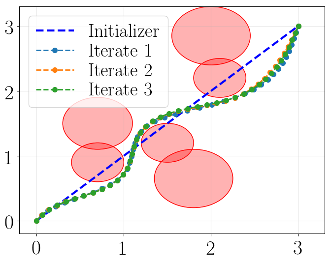

# Analysis of Theoretical and Numerical Properties of Sequential Convex Programming for Continuous-Time Optimal Control

## Description

SCP implementation for experiments presented in https://arxiv.org/abs/2009.05038.

<p align="center">
  
  <br /><em>Example of trajectory for a Dubins car model navigating in a cluttered environment.</em>
</p>

## Setup

This code was tested with Julia 1.4.1. Experiments can be reproduced by running the jupyter notebooks in the root folder:
```bash
  jupyter notebook
```

## Reference

R. Bonalli, T. Lew, and M. Pavone, ["Analysis of Theoretical and Numerical Properties of Sequential Convex Programming for Continuous-Time Optimal Control,"](https://arxiv.org/abs/2009.05038) in Arxiv, 2020.